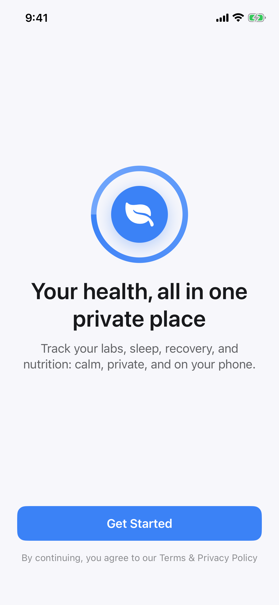
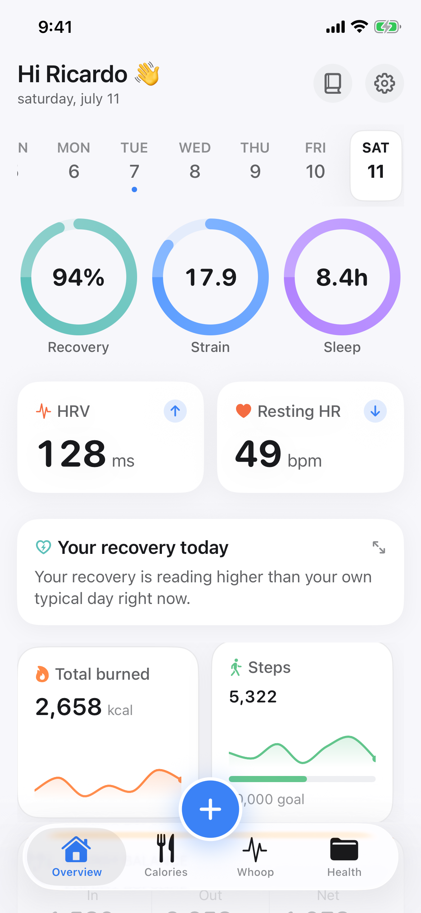
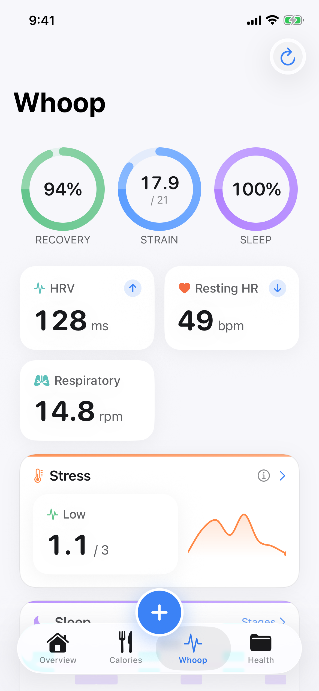
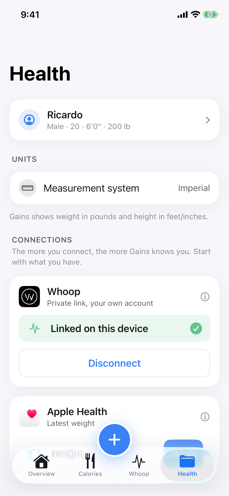
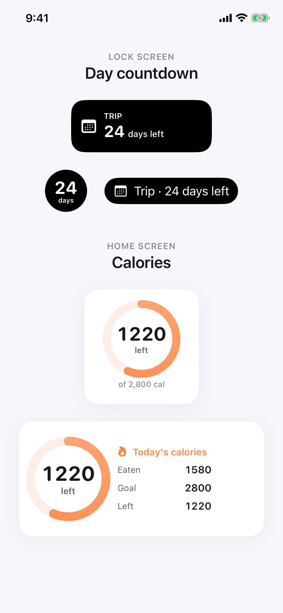
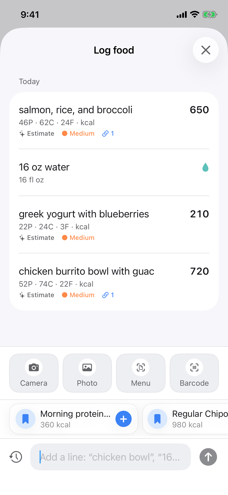
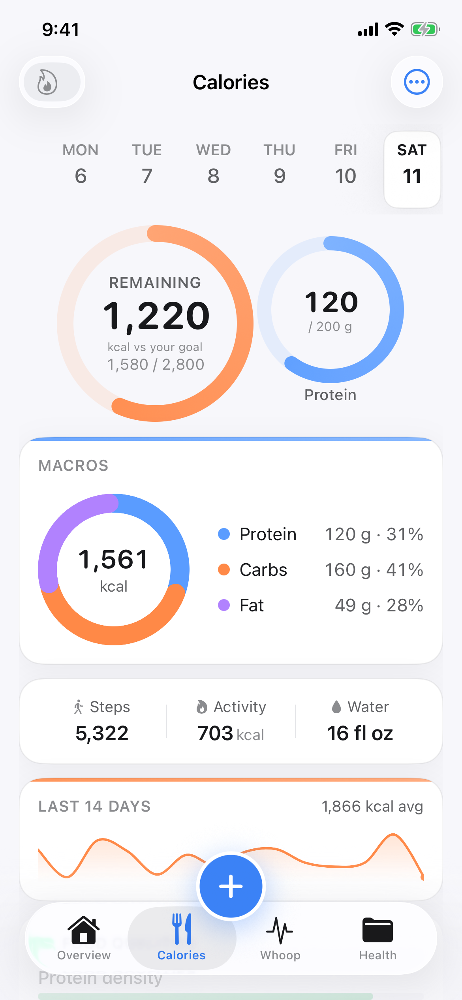
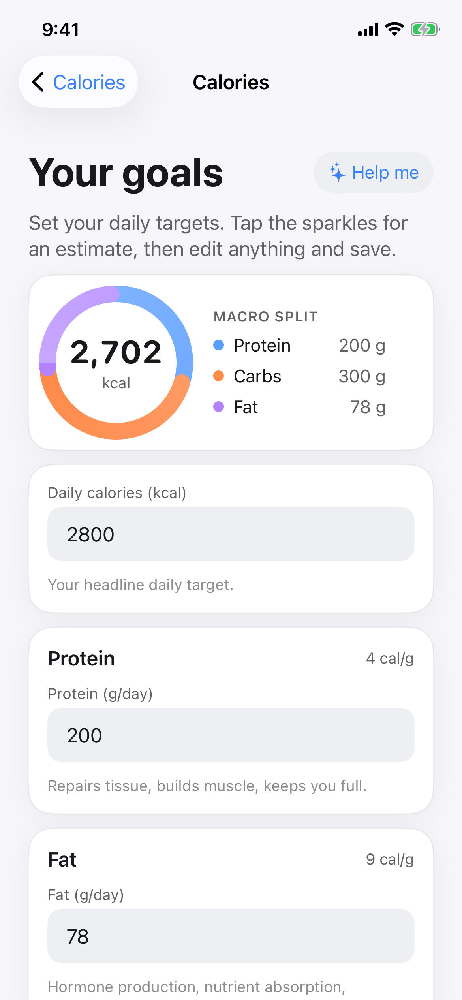
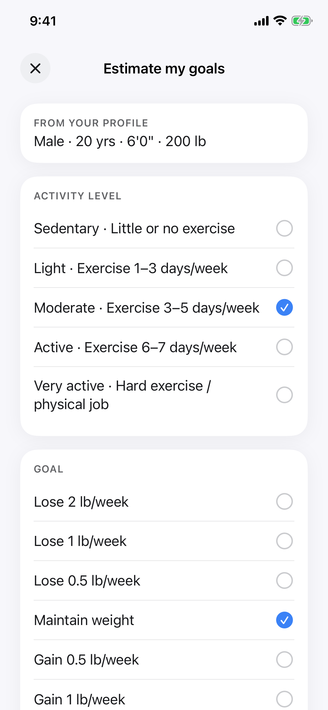

# Gains

A private, local-first iPhone app that keeps your health data in one encrypted record on your device: nutrition, body weight, steps and activity, and Whoop recovery, sleep, and strain. Native Swift/SwiftUI, iOS 18+.

## Screens

<p align="center">
  
  
  
</p>
<p align="center">
  
  
</p>
<p align="center"><em>Onboarding, Overview, Whoop, Health, and lock-screen widgets, shown with sample data.</em></p>

### Calorie tracking

<p align="center">
  
  
</p>
<p align="center"><em>A notes-style food log with per-item macros, water, and saved meals, plus the day's calorie ring and macro donut. AI estimates are optional and show a confidence level and their sources.</em></p>

### Set your goals

<p align="center">
  
  
</p>
<p align="center"><em>Set daily calorie and macro targets by hand, or tap "Help me" to estimate them from your profile (activity level and weight goal), then edit and save.</em></p>

### How the food logging works

You type or photograph what you ate. The app sends only that description, through a single audited egress point, to a model running on **your own [OpenRouter](https://openrouter.ai) key**, and gets back calories and macros as an **editable estimate** with a confidence level and cited sources. Barcodes resolve locally through Open Food Facts; novel or restaurant foods use a web-grounded model that returns citations. Nothing is written automatically. Every estimate is yours to confirm or edit before it lands in the log. Without a key, logging still works and you enter the macros yourself.

## Features

- **Local and private.** Your record is encrypted at rest on the device (AES-256-GCM via CryptoKit, key in the Keychain). Nothing leaves the phone unless you opt in.
- **Nutrition.** A notes-style food log with macros and micros, saved meals, recents, and barcode scanning through Open Food Facts. Optionally estimate calories and macros from a text or photo description using your own OpenRouter key.
- **Body weight.** A weight trend, with optional import from Apple Health.
- **Whoop.** Read-only recovery, sleep, and strain on the dashboard.
- **Lock-screen widgets.** A calories ring, and a day-countdown ("X days left") to a date you set in the app.
- **Personal MCP server (optional).** A small self-hostable server (`server/`) that exposes a read-only slice of your data over the Model Context Protocol, so you can ask questions across domains from an MCP client. Off by default.

> **Whoop integration: use at your own risk.** Whoop has no public API for this data, so the app reads it through Whoop's private app API. That works today, but it is unofficial and not sanctioned by Whoop, so linking your account could get it rate-limited or banned. Enable the Whoop integration at your own risk.

## Repo layout

| Path | What |
|------|------|
| `Sources/` | The iOS app. SwiftUI views and `@Observable` view models; external dependencies (HealthKit, Whoop, Keychain, AI provider, persistence) sit behind thin protocols. |
| `Tests/`, `UITests/` | Unit and UI tests. |
| `server/` | The optional personal MCP server (TypeScript, deploys to Fly). |
| `docs/` | Screenshots and assets. |

## Build

Requires Xcode 16+. The Xcode project is generated from `project.yml` by [XcodeGen](https://github.com/yonaskolb/XcodeGen), so there's no committed `.xcodeproj`. Generate it first:

1. Install XcodeGen: `brew install xcodegen`
2. Generate the project: `xcodegen generate`
3. Open and run from Xcode: `open Gains.xcodeproj`

Or build straight to a simulator after step 2:

```sh
xcodebuild -project Gains.xcodeproj -scheme Gains \
  -destination 'platform=iOS Simulator,name=iPhone 16' build
```

Re-run `xcodegen generate` whenever you add or remove source files. AI food logging needs your own [OpenRouter](https://openrouter.ai) key, added under **Settings**; without one, logging still works and you type the macros yourself.

## Personal MCP server (optional)

See [`server/README.md`](server/README.md). It deploys to Fly and holds your data slice in memory only; the app's **Settings → AI Connector (MCP)** connects to it with a token you set. Optional, and off by default.

## Credits

- The food logging is inspired by **Amy**.
- The visual design is inspired by **Bevel**.

## License

[MIT](LICENSE).
